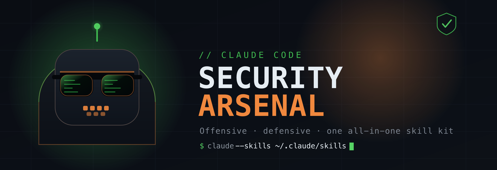

<p align="center">
  
</p>

<h1 align="center">Claude Code Security Arsenal</h1>

<p align="center">
  <b>One all-in-one collection of the best cybersecurity skills for Claude Code.</b><br>
  A battle-tested 22-skill core, bundled — plus a curated map of the whole ecosystem.
</p>

<p align="center">
  
  
  
  
  
</p>

---

Claude Code skills are structured `SKILL.md` packages that give Claude deep,
domain-specific expertise the moment a matching task shows up. There are a lot of
good security skill sets scattered across GitHub. This repo pulls the strongest
of them into **one place**: install once and Claude Code gains a full offensive
**and** defensive toolkit — recon, web, cloud, red team, malware RE, threat intel,
DFIR, detection engineering, GRC, supply chain, AI/LLM and OT/ICS security.

It's a **curation, honestly credited**. The bundled core is
[Masriyan's](https://github.com/Masriyan/Claude-Code-CyberSecurity-Skill) MIT-licensed
work; the wider catalog links straight back to every author. See [CREDITS](CREDITS.md).

> **Authorized use only.** These skills are for engagements you're permitted to
> run, systems you own, CTFs, labs and education. Unauthorized testing is illegal
> in most places. The offensive skills ask for scope before they help — that gate
> is a feature. Read [`docs/ETHICS.md`](docs/ETHICS.md) first.
>
> Not affiliated with or endorsed by Anthropic.

## Quick start

```bash
git clone https://github.com/marcosdeaza/claude-code-security-arsenal.git
cd claude-code-security-arsenal
./install.sh                 # copies the 22-skill core into ~/.claude/skills
```

Options:

```bash
./install.sh --link          # symlink instead of copy (git pull keeps skills updated)
./install.sh --external      # also pick external collections to clone from source
```

Prefer to do it by hand? Copy any `skills/NN-*` folder into `~/.claude/skills/`
(global) or your project's `.claude/skills/`. Restart Claude Code to load them.

## What's inside

**Bundled core — 22 skills** (`skills/`), grouped in the full index → [`SKILLS.md`](SKILLS.md):

| Area | Skills |
|---|---|
| Offensive & pentest | recon-osint · exploit-development · web-security · red-team-ops · mobile-security |
| Defensive & detection | threat-hunting · incident-response · csoc-automation · log-analysis · blue-team-defense |
| Analysis & forensics | reverse-engineering · malware-analysis · network-security · crypto-analysis |
| Threat intel & purple team | threat-intelligence · purple-team |
| Modern surfaces | cloud-security · ai-llm-security · ot-ics-security |
| Assurance & governance | vulnerability-scanner · grc-compliance · supply-chain-security |

Each skill ships its `SKILL.md`, runnable scripts and reporting templates, plus a
shared [authorization gate](skills/_shared/authorization-gate.md) and
[report template](skills/_shared/reporting-template.md) added by this collection so
every finding comes out in the same, client-ready shape.

**The wider arsenal — curated catalog** (linked, not copied) → [`docs/CATALOG.md`](docs/CATALOG.md):

| Collection | Best for | License |
|---|---|---|
| [claude-red](https://github.com/SnailSploit/claude-red) | breadth of single-surface offensive methodology | MIT |
| [Claude-BugHunter](https://github.com/elementalsouls/Claude-BugHunter) | bug bounty & external recon at scale | MIT |
| [offensive-claude](https://github.com/hypnguyen1209/offensive-claude) | kill-chain-driven engagements | MIT |
| [red-run](https://github.com/blacklanternsecurity/red-run) | skills + MCP + agent-team orchestration | GPL-3.0 |
| [secskills](https://github.com/trilwu/secskills) | securing your own code (dev-side) | MIT |
| [cybersecurity-claude-skills](https://github.com/mahmutka/cybersecurity-claude-skills) | focused web + secure code review + CTF | MIT |
| [awesome-skills-security](https://github.com/Eyadkelleh/awesome-skills-security) | SecLists wordlists & injection payloads | no license |

## How a skill activates

Describe the task ("audit this repo's dependencies for known CVEs", "map these
IOCs to ATT&CK", "review this Terraform for cloud misconfig") and Claude Code
loads the matching skill's methodology, commands and output format. You can also
name a skill directly. Skills are just files — read them, edit them, fork them.

## Contributing

Add a collection to the catalog, improve the shared layer, or fix an attribution:
open an issue or PR. Corrections to credit are always welcome and always honored.
For the bundled skills' methodology itself, contribute
[upstream to Masriyan's repo](https://github.com/Masriyan/Claude-Code-CyberSecurity-Skill).

## Credits

Curated by [Marcos de Aza](https://github.com/marcosdeaza). The skills are the work
of the authors in [CREDITS.md](CREDITS.md) — star their repos; that's where the
real work lives. Ecosystem cross-checked against Snyk's
[Top 9 Claude security skills](https://snyk.io/articles/top-claude-skills-cybersecurity-hacking-vulnerability-scanning/)
and the [Claude Directory](https://www.claudedirectory.org/for/security).

## License

MIT for this repository's original work (curation, catalog, installer, shared
layer, docs, artwork) — see [LICENSE](LICENSE). Bundled third-party skills keep
their own licenses; see [NOTICE](NOTICE) and [THIRD_PARTY_LICENSES.md](THIRD_PARTY_LICENSES.md).

## Disclaimer

Provided as-is, for authorized security work and education only. You are solely
responsible for staying within the law and your authorization. Neither the curator
nor the original authors are liable for misuse.
